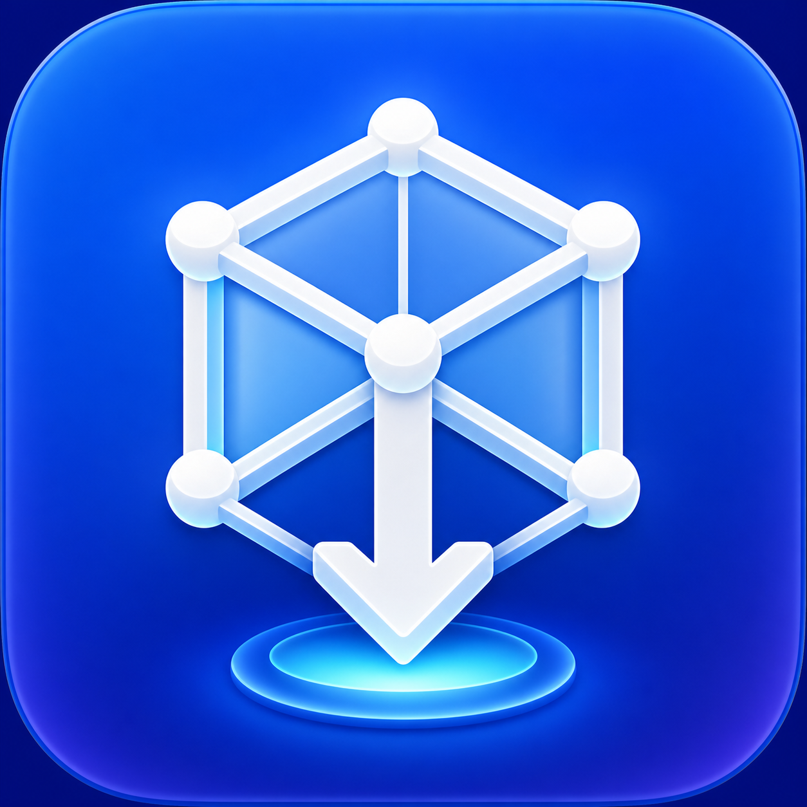
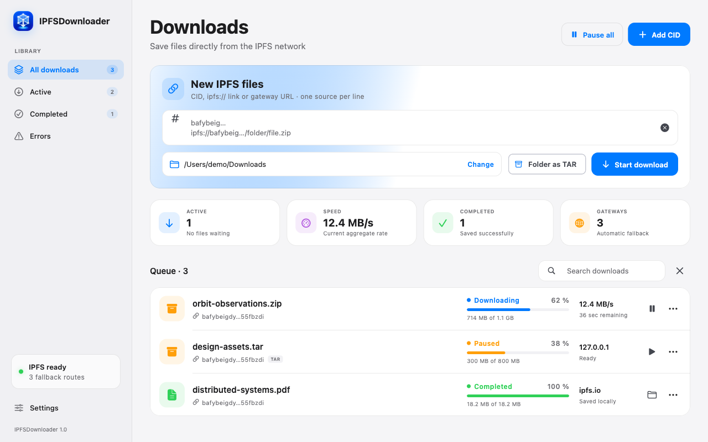

<div align="center">
  

  <h1>IPFSDownloader</h1>

  <p><strong>A focused, resilient desktop download manager for IPFS.</strong></p>
  <p>Queue, pause, resume, and route downloads through fallback gateways in a native-feeling Flutter app.</p>

  <p>
    <a href="https://flutter.dev/">
      
    </a>
    <a href="https://dart.dev/">
      
    </a>
    
    
  </p>
</div>

<p align="center">
  
</p>

> [!IMPORTANT]
> Prebuilt packages for macOS, Windows, and Linux are available from the
> [GitHub Releases page](https://github.com/AnSieger/IPFSDownloader/releases).
> Release builds are currently unsigned and the macOS build is not notarized.

## Highlights

| Resilient transfers | Desktop workflow |
| --- | --- |
| **Pause and resume** with validated HTTP range responses | **Persistent queue** restored across app restarts |
| **Automatic gateway fallback** between local and public endpoints | **Parallel downloads** with configurable concurrency |
| **Safe `.part` files** followed by atomic completion | **Bulk input** with one CID or URL per line |
| **Smart file detection** using content, MIME type, and response headers | **Queue controls and filters** for active, completed, and failed tasks |
| **UnixFS directory export** as an uncompressed TAR archive | **Light and dark themes** designed for desktop screens |

Additional safeguards sanitize server-provided filenames, prevent silent overwrites, and retain partial files when a transfer is paused.

## Platform and language support

IPFSDownloader uses one Flutter codebase for the three desktop targets:

| Platform | Run target | Release output |
| --- | --- | --- |
| Windows | `windows` | `build/windows/x64/runner/Release/` |
| macOS | `macos` | `build/macos/Build/Products/Release/` |
| Linux | `linux` | `build/linux/x64/release/bundle/` |

The interface is available in:

- Deutsch
- English
- Français

Choose a language in **Settings → Appearance → Language**, or leave the setting on **System**. Unsupported system languages fall back to English.

## Build from source

### Requirements

- [Flutter 3.41.6 or newer](https://docs.flutter.dev/get-started/install)
- Dart 3.11.4 or newer, included with a compatible Flutter SDK
- The desktop toolchain for your operating system, as described in Flutter's [desktop documentation](https://docs.flutter.dev/platform-integration/desktop)

Clone or download this repository, enter its directory, and install the dependencies:

```bash
flutter pub get
```

Run the app for the platform you are currently using:

```bash
flutter run -d macos
```

Replace `macos` with `windows` or `linux` as appropriate.

Create a release build with the matching host command:

```bash
flutter build macos --release
flutter build windows --release
flutter build linux --release
```

Flutter desktop builds are host-specific, so run only the command supported by the current operating system.

The project does not currently sign or notarize release builds. The macOS release target is intended for direct distribution and is deliberately not App-Sandboxed, allowing persisted user-selected download folders to remain writable after an app restart. Review signing, notarization, and sandbox requirements before distributing a build through a store.

## Usage

1. Select **Add CID** and paste one or more IPFS references, one per line.
2. Choose a destination directory and, for a UnixFS directory, enable TAR export if needed.
3. Start the import and monitor progress in the queue.
4. Pause, resume, retry, reorder, or remove individual tasks from the task controls.
5. Configure concurrency, timeouts, themes, and gateway priority in **Settings**.

### Accepted input formats

```text
Qm...                                      # CIDv0
bafy...                                    # CIDv1 (Base32)
ipfs://bafy.../folder/file.pdf
/ipfs/bafy.../folder/file.pdf
https://dweb.link/ipfs/bafy.../file.pdf
https://<cid>.ipfs.dweb.link/file.pdf
```

An IPFS CID does not always carry the original filename. For a bare file CID, IPFSDownloader creates a safe CID-based name and then determines a suitable extension from magic bytes, `Content-Type`, and `Content-Disposition`. When the input path already includes an explicit extension, its final path segment is preserved.

## Security and trust model

IPFSDownloader currently downloads through HTTP gateways. A conventional gateway returns an already reconstructed UnixFS file, so the application trusts that gateway to validate and serve the requested content. It does not independently retrieve and verify every IPFS block. This is the IPFS specification's [trusted gateway model](https://docs.ipfs.tech/reference/http/gateway/#trusted-vs-trustless).

Requests sent to a public gateway reveal the requested CID and path to that gateway operator. Put a trusted local gateway first in **Settings** when that distinction matters.

During a download, the application:

- sanitizes gateway-provided filenames to prevent path traversal;
- writes to a `.part` file before completing a transfer atomically;
- avoids silently replacing an existing finished file;
- accepts resume data only after validating `206 Partial Content` and `Content-Range`;
- keeps partial data when paused so a later request can resume it safely.

Independent local block verification, for example through an embedded or locally installed Kubo node, is not implemented yet.

## Architecture

```text
lib/
├── l10n/          English, German, and French ARB resources
└── src/
    ├── application/   Queue scheduling, concurrency, and UI state
    ├── core/          IPFS parsing, validation, formatting, and platform actions
    ├── data/          HTTP download engine and local persistence
    ├── domain/        Download-task and settings models
    ├── presentation/  Responsive desktop interface
    └── theme/         Colors, typography, and component styling
```

The download engine is independent from the presentation layer, while the controller coordinates queue state, persistence, and concurrent work. The desktop UI observes that controller and adapts between compact and wide layouts.

## Development

Install dependencies, format the code, run static analysis, and execute the test suite before submitting changes:

```bash
dart format --output=none --set-exit-if-changed .
flutter analyze
flutter test
```

The included GitHub Actions workflow runs analysis and tests and compiles release bundles for Windows, macOS, and Linux.

## Project scope

Classic download managers inspired the queue, link-grabber, concurrency, and transfer-control workflow. IPFSDownloader is purpose-built for IPFS, so hoster plug-ins, captchas, premium accounts, and router reconnect features are intentionally outside its scope.

## Contributing

Issues and pull requests are welcome. Please keep changes focused, include tests for behavioral changes, and ensure the development checks above pass.

## License

IPFSDownloader is available under the [MIT License](LICENSE).
